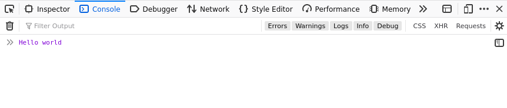

## What is JavaScript 
___

* JavaScript an interpreted which means each line is compiled at a time.

* It is also a scripting language (in its name though) which means javascript can be used to automate a task.

* Dynamic language, you don't have to specify the type of value during declaration.

* An oject-oriented programming language, programmer can use object oriented concepts in javascript.

* Single Threaded programming language, unlike other programming languges JS doesn't provide a multi threading mechanism to do multiple task at a time.


## Uses of JavaScript 
___

* To make interactive webpages, hiding contents on a specific condition or run a piece of code on a button click.

* Can be used to make web apps , mobile apps also desktop apps. There are so many frameworks out there to do the same.

     **Some of the frameworks/Libraries and its uses are given below**

    | Framework/Libraries     | Uses         | Companies |
    | ------------------------|:-------------|-----------|
    | ReactJS       | To make single page web Application|Amazon|
    | Vue.js         |To make single page web Application|Xiaomi|               
    | AngularJS     | For making web-apps    |Paypal|

* Building web servers and server applications.
* Can be used to build browser games.


## **Let's get started**  :rocket:

### Setting up the environment

1. Make a new file and name it as ```index.html``` add ```<html>``` ,```<head>```,```<body>``` tags

2. Make another file and name it as  ```main.js```

3. Next, in your index.html file enter the following element on a new line just before the closing ```</body>``` tag:

    ```html
    <script src="main.js"></script>
    ```

4. Add the following code to    ```main.js```

    ```javascript
    console.log("Hello world");
    ```

5. Copy the path of the ```index.html``` and paste in the browser url box and press ```Enter```.

6. Press ```Ctrl``` + ```Shift``` + ```i``` to get the developer console. you can get this option from browser menu too. **We will be using console for most of our time**

7. You will get the result as seen below.

    

8. So that's that . There you go for your traditional **"Hello world"** program.

    


|  <span style="font-size:30px">Table of contents</span>       |
|--------------------------|
|1. [Variables](#variables)|
|2. [Comments](#comments)|
|3. [Conditionals](#conditionals)|
|4. [Loops](#loops)|
|5. [Functions](#functions)|
|6. [Function Expression](#function-expression)|
|7. [Arrow Functions](#arrow-function)|
|8. [Strings](#strings)|
|9. [Arrays](#arrays)|
|10. [Assignment](#assgignment) |
|11. [References](#references)|


## Variables
___
* Variables are used to store values in it.

* In JS we can use

    ```let``` or ```var``` (not recommended though) 
    
    to declare variables.
* Look at an Example given below:

    ``` javascript
    let myVariable1;
    var myVariable2;
    ```

    > :spiral_notepad: Semicolon at the end is not necessary but it's a good practice to use it. It increases the readability of our code.

* After declaring the variable you can give it a value

    ```javascript
    myVariable1 = 12;
    myVariable2 = "leo";
    ```
    > :spiral_notepad: In js, if you have a value to give it to a variable(initialization) you can initialize without declartion
    ``` myVar = 30; ``` is enough but ```not recommended```.You can also use `const `keyword to intialise a variable. 

    ```javascript
       const myVariable="heizenberg"; // const variables must be initialzed when declared

       myVariable="Walter white";// Error . You can't re-initialize a const variable 
    ```
    
* To get the value , just call the variable

    ```javascript
        myVariable1; // gives out 12
    ```
* You can change the value inside variables by simply `re-initializing` with other value (won't work for const variables).
    ```javascript
    myVariable1 = 67; // value of myVariable1 is 67
    ```


|Variable Type | Explanation in line| Example|
|--------------|-------------|--------|
|```string```|Sequence of text.|```let myVar = 'Lionel';```|
|```number```|A number|```let myVar = 45;```|
|```boolean```| true or false|```let myVar = true```|
|```object```|Other than the above types |```let myVar = [5,6,7]; //Array type  ```<br> ``` let myVar = {name:"Leo"} //Object type```|

> :spiral_notepad: ```typeof variable name ``` to get the type of a variable.For example ```typeof "exam" ``` give ```string``` and so on

> [See the examples](https://codesandbox.io/s/variables-6jrkb)
## Comments
___

* Coments are notes which is writtern along with the code.

* It increses the readability of the code .

1. **Multi-line comment**

    ```javascript
    /*
        Anything writtern here will not be interpreted by javascript interpreter. 
    */
    ```

2. **Inline comment**
    ```javascript
    let mVar=45; //in-line comments are writtern like this.
    ```
## Operators
___

* An operator is a mathematical symbol which produces a result based on two values (or variables).

|Operator|Explanation|Symbols|Examples|
|--------|-----------|-------|--------|
|Addition|to add two numbers or to concatenate|`+`|`1+2; // 3`<br> `'i'+'am'; //iam`|
|Subtraction<br>Multiplication<br>Division|Basic maths|`-`,`*`,`/`|`2*3;`etc.|
|Assignment|used to assign a value to a variables|`=`|`let mVar=5;`|
|Equality|check whether the two values are same| `===`| `3===4; //return false`<br>`let mVar=5;`<br>`let mVar2=5;`<br>`mVar===mvar2//returns true`
|Not,Does not equal|Returns logically opposite value. true to false and false to true|`!`,`!==`|`let mVar=1;`<br>`mVar!==1;//return false`

### Assignment Operators

|Operator|Example|Same As|Result in x|
|--- |--- |--- |--- |
|=|x = y|x = y|x = 5|
|+=|x += y|x = x + y|x = 15|
|-=|x -= y|x = x - y|x = 5|
|*=|x *= y|x = x * y|x = 50|
|/=|x /= y|x = x / y|x = 2|
|%=|x %= y|x = x % y|x = 0|

### String operators
|Operator|Example|text1|text2|text3|
|--- |--- |--- |--- |--- |--- |
|+|text3 = text1 + text2|"Good "|"Morning"|"Good Morning"|
|+=|text1 += text2|"Good "|"Morning"|"Good Morning"|


### Comparison operartors
|Operator|Description|Comparing|Returns|
|--- |--- |--- |--- |
|==|equal to|5 == 8|false|
|===|equal value and equal type|5 === "5"|false|
|!=|not equal|5 != 8|true|
|!==|not equal value or not equal type|5 !== "5"|true|
|>|greater than|5 > 8|false|
|<|less than|5 < 8|true|
|>=|greater than or equal to|5 >= 8|false|
|<=|less than or equal to|5 <= 8|true|


> :spiral_notebook: [Refer W3Schools](https://www.w3schools.com/jsref/jsref_operators.asp) to get study more about operators. 

> [See the examples](https://codesandbox.io/s/operators-and-conditionals-diqf3)

## Conditionals
___

* Conditionals are code structures which allow you to test if an expression returns true or not, running alternative code revealed by its result.

**`if` statement**
    
* To specify a block of code to be executed, if a specified condition is true

### Syntax
    
```javascript
    if(condition){ 
        //Executed if condition is true
    }
```


**`else` statement**

* To specify a block of code to be executed, if the same condition is false

* Has no exsistence without `if` statement
    
### Syntax

```javascript
    if(condition){
        //Executed if condition is true
    }
    else{
        // Executed if condition is false
    }
```

**`else-if` statement**

*   Programmer can write a ladder of `else if ` with conditions between `if` and `else` .

### Syntax

```javascript
if (condition1) {
  //   executed if condition1 is true
} 
else if (condition2) {
  //  executed if the condition1 is false and condition2 is true
} 
else {
  //  executed if the condition1 is false and condition2 is false
}
```

**`switch` statement**

* `switch` statement selects one of many code blocks to be executed.

### Syntax

```javascript
switch(expression) {
  case x:
    // code block
    break;
  case y:
    // code block
    break;
  default:
    // code block
}
```
> [See the examples](https://codesandbox.io/s/conditionals-rdd59)

## Loops
___

* When you want to use the same code again and again,with a different value.
    
### Different types of Loop in JS

1. `for`
2. `for-of`
3. `for-in`
4. `while`
5. `do-while`

### `for` Loop

* Runs the code inside the braces till the condition become false

#### Syntax

```javascript
for (initialization; condition; updation) {
  // code block to be executed
}
```

> :green_book: Initialization,condition and updation is optional

### `for-in` Loop

* Used to iterate over properties of an object.

#### Syntax

```javascript
for (prop in object_name) {
    // This loop iterates over the properties of the objects
    //eg: for array it is its index
}
```

### `for-of` Loop

* Used to iterate over the property values of an `object`.

### Syntax

```javascript
for (item of iterable) {
  // code block to be executed
  // eg: for array the array values will be loaded each time in item
}
```

### `while` Loop

* Loops through a block of code as long as a specified condition is `true`.

### Syntax

```javascript
while (condition) {
  // code block to be executed till the condition is false
}
```

### `do-while` Loop

* will loop at least once without checking the condition

```javascript
do {
  // code block to be executed till the condition is false.
}
while (condition);
```
> [See the examples](https://codesandbox.io/s/loops-7jlq8)
## Functions

___

* A JavaScript function is defined with the `function` keyword, followed by a **name**, followed by parentheses **()**.

* Function names can contain letters, digits, underscores, and dollar signs (same rules as variables).<br>
**Examples: myFunction,getResult,_myFunct,my_Funct**

* The parentheses may include parameter names separated by commas
**(parameter1, parameter2, ...)**

* Block of code placed inside curly brackets **{ }**

    ### Syntax

    ```javascript
    function name(parameter1, parameter2) {
    // code to be executed
    }
    name(value1,value2); // function is invoked
    ```

* **we can call the function by writing name of the function followed by paranthesis .Actually `()` operator calls the function. if the function takes parameters it has to be given when the function is called.** 

* A function can `return` a value from the function.
like this
* A function with `return` value  is called a **fruitful function**

### Syntax
  
```javascript
    function name(parameter1, parameter2) {
        // code to be executed   
        return something;
    } 
    let result=name(value1,value2); // function is invoked
```

## Function Expression

___

* A function without name is called function expression.
* It can be stored in a variable.

### Syntax

```javascript
let myFunct=function(parameter1,parameter 2){
    return something;
    };

myFunct(value1,value2); // 
```

## Arrow Function

___

* Arrow function is almost same as the [function expression](#function-expression)

* Reduces the function syntax to `=>` . Thus the name Arrow functions.

### Syntax

```javascript

let myFunct= ()=> "Hello world";  //By default the value is returned from the statement.
    
    //or

let myFunct2= ()=>{
    //some code
    // if this function returns anything you have to call return explicitly
    return "something";
}

//calling these function is same as calling functions.
// You know how to do that right ?
```
> [See the examples](https://codesandbox.io/s/functions-w9mc5)
## Strings
___

* String is a sequence of characters starts from `0` **to length of the string** `-1`.

* string is **immutable** in JS. That is you cannot alter an exsisting string.

* There are so many built-in methods for `string` type.

* You can use either `"` or `'` but not both to specify a string in JS.

* Let us discuss some useful string methods and properties.

```javascript
let myVar = "i am good to go";// declaring and initializing a string literal
```

|Method/property|Explanation|Result|
|--------|-----------|------|
|`myVar.length`|Gives out the length of the string |`5`|
|`myVar.indexOf('to')`|Gives out the index of 't' in "to"|`10`|
|`myVar.lastIndexOf('o')`|Gives the last index of 'o'|`14`|
|`myVar.split(" ")`|Splits the string into array with space as delimiter|`[ "i", "am", "good", "to", "go" ]`|
|`myVar.replace("to","foo")`|Gives out a string which have "to" replaced with "foo"|`i am foo good`|
|`myVar.toUpperCase()`|Returns string with all capital letters|`I AM GOOD TO GO`|
|`myVar.toLowerCase()`|Returns string with all capital letters|`i am good to go`|

> :spiral_notepad: There are other string methods. [Refer MDN to study more about strings](https://developer.mozilla.org/en-US/docs/Web/JavaScript/Reference/Global_Objects/String).
 
>  Find what is a String literal and String object ?. Also find what is a `property` in javascript.

> [See the examples](https://codesandbox.io/s/strings-t95f3)

## Arrays

___

* Array can hold more values at a time.

* Array is **heterogeneous** in javascript, which means it can hold multiple values of different types at a time,

* Array indexes starts from `0` **to** `size of array - 1`

* Array can be created by
Array literal.(By now You should know what is a literal right ?)

* Array is `mutable`. i.e the array can be altered.

### Syntax

```javascript
let array_name=[item1,item2,...]; 
```

**Array can also created by using Array object**

### Syntax

```javascript
 let array_name = new Array(item1,item2,...); 
```
 > `new` keyword is used to allocate space for this array object.

**How to access an element from an array ?**

```javascript
let element = array[index]; // index can be any value between 0 and array size - 1 
```

**How to mutate an array ?**

```javascript
array_name[index] = value; //value is stored in corresponding index in the array
```

**How to delete an item ?**

```javascript
delete array_name[index]; //Need an explanation?
```

 > :spiral_notepad: Like `string` type there are numerous builtins for Array type too.
 
 **Let us discuss some commonly useful array methods and properties with an example**
 
 ```javascript
 let myArray = ["good","bad","dude",6]; // creating an array literal and myArray is the array name 
 ```

 |Method/property|Explanation|
 |----|---|
 |`myArray.length`|Returns the size of the array|
 |`myArray.forEach()`|Used to iterate over the each item in array|
 |`myArray.push()`|Used to push new element to array|
 |`myArray.pop()`|Used to pop the last element from the array |
 |`myArray.toString()`|Used to get the string of the array|
 |`myArray.join()`|Used to join the elements in an array to make a string|
 |`myArray.splice()`|To slice the elements of array with index|

> [See the examples](https://codesandbox.io/s/arrays-d4pxm
)

# Assignment

**Javascript with in a day is overwhelming. We know that.**

## **Problem statement:**

**"Make a simple fortune teller function which retuns a fortune
string randomly."**


### **Hints**:

1. Write a function skelton
2. Add some strings to an [Array](#arrays)
3. Use `Math.random()` method to get random decimal value number.
4. Make the random number in range of array size and make it an integer(Tricky part. **DIY**).

4. Call the string with index generated from `Math.random`

5. No more Hints.

## References

-   [Mozilla Developer Network](https://developer.mozilla.org/en-US/docs/Web/JavaScript)

-   [W3Schools](https://www.w3schools.com/)

- Took some Gifs from [giphy](https://giphy.com/) :laughing: